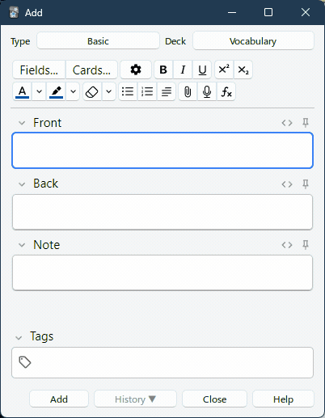

# anki-video

Inline video player support for Anki.

## Getting Started

### Prerequisites
 
  1. You need `ffmpeg` and `ffprobe` in your `$PATH`.  
     Windows: install from [scoop](https://scoop.sh/#/apps?q=ffmpeg)  
     macOS: install from [homebrew](https://formulae.brew.sh/formula/ffmpeg)  
     Linux: you know how!  
  2. Go to Anki -> Tools (menubar) -> Add-ons -> Install from file  
  3. Select file downloaded from releases page  

## Usage
Drag and drop video files into any of the fields in the "Add card" window. For best results, use only `.webm` files. Other video formats will be automatically converted in the background, but this takes a long time.

## License
Distributed under the MIT license. See `LICENSE.txt` for more information

## Acknowledgements
Uses [video.js](https://github.com/videojs/video.js), included under the Apache 2.0 license. See the top of the video.js-related files for license details.
